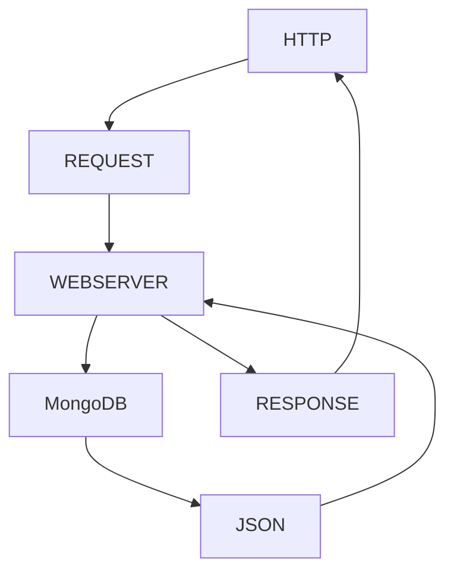
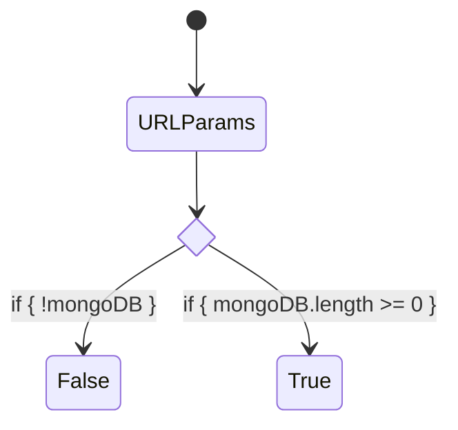

# El lenguaje Markdown

## Índice de contenidos

- [El lenguaje Markdown](#el-lenguaje-markdown)
  - [Índice de contenidos](#índice-de-contenidos)
  - [Diagrama de flujo con Markdown y Mermaid:](#diagrama-de-flujo-con-markdown-y-mermaid)
  - [Diagrama de flujo condicional](#diagrama-de-flujo-condicional)
  - [Peticiones HTTP](#peticiones-http)
    - [Método POST](#método-post)
    - [Método PUT](#método-put)
    - [Método PATCH](#método-patch)
    - [Listado de tareas 21-03-2023](#listado-de-tareas-21-03-2023)
    - [Agregar una imagen en nuestro documento](#agregar-una-imagen-en-nuestro-documento)

La extensión instalada nos permitirá __crear documentación en formato Markdown__, directamente desde nuestro editor de código.

El ***archivo en formato .md***, al ser subido a la plataforma **Github** con el resto de nuestro proyecto, disponibilizará la documentación en el mismo formato que veremos a la derecha de la pantalla.

## Diagrama de flujo con Markdown y Mermaid:



## Diagrama de flujo condicional

## Peticiones HTTP

 
| **PETICION** | **URL** | **DESCRIPCION** |
|:----------:|----------|----------|
| GET    | [/frutas](/frutas)   | retorna todos los productos. |
| GET    | [/frutas/:id](/frutas/:id) | retorna un producto coincidente. |
| GET    | [/frutas/nombre/:nombre](/frutas/nombre/:nombre)   | retorna uno o más productos que coincidan en su nombre con el parámetro indicado. |
| GET    | [/frutas/importe/:precio](/frutas/importe/:precio)   | retorna el o los productos que contengan un precio igual o mayor al indicado. |
| POST    | [/frutas](/frutas)   | Permite dar de alta un nuevo producto. _(verifica el apartado Nuevo Producto para ver qué debes informar en el cuerpo del mensaje)_. |
| PUT    | [/frutas](/frutas)   | Permite modificar  un producto existente. _(verifica el apartado Nuevo Producto para ver qué debes informar en el cuerpo del mensaje)_. |
| DELETE    | [/frutas/:id](/frutas/:id)   | Elimina un producto. |

### Método POST
```javascript
    {
        imagen: '🐲',
        nombre: 'Dragon Fruit',
        precio: 1400,
        stock: 95
    }

    // El id no es necesario informarlo. 
    // El servidor se ocupa de resolverlo.
```

### Método PUT
```javascript

    //URL BASE
    'https://midominio.com/api/v1/frutas'

    //CUERPO DEL MENSAJE
    {
        imagen: '🐲',
        nombre: 'Dragon Fruit',
        precio: 1400,
        stock: 95
    }

    //El id no es necesario informarlo. El servidor se ocupa de resolverlo
    
```

### Método PATCH

```javascript
/*
Nuestra API no soporta el método PATCH. 
Está construido y disponible solo para el ambiente de desarrollo y QA, 
pero para el exterior este método no funciona.
*/
```

### Listado de tareas 21-03-2023

- [x] Construcción del servidor web Express
- [x] Definición de las rutas y métodos HTTP
- [x] Integración con la base de datos MongoDB
- [x] Desarrollo de la lógica de cada Método HTTP
- [ ] Control de errores al utilizar cada método HTTP
- [ ] Integración de Token a las peticiones HTTP


### Agregar una imagen en nuestro documento


https://www.mediachicas.org/

[Visitar Mediachicas](https://www.mediachicas.org/)

    frutas.forEach(fruta => console.log(fruta))


```
const resultado = frutas.filter(fruta => fruta.stock > 50)
```


